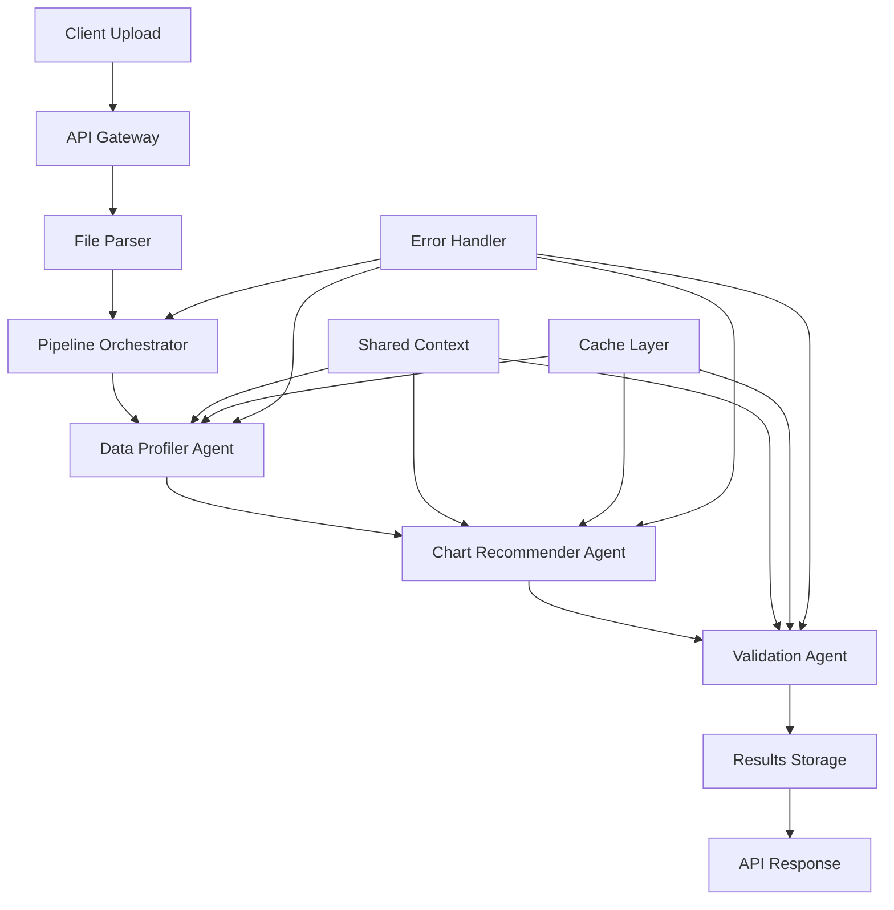

# Design Document

## Overview

This design document outlines the refactored backend agentic pipeline architecture that streamlines the current complex system into a clean, efficient, and maintainable solution. The design focuses on simplifying the existing multi-approach system while preserving all core functionality and maintaining the current tech stack.

The refactored system will provide a single, linear pipeline flow (Profiler → Recommender → Validator) with efficient data sharing, robust error handling, and optimal performance characteristics.

## Architecture

### High-Level Architecture



### Core Components

1. **Pipeline Orchestrator**: Single entry point that manages the linear agent flow
2. **Shared Processing Context**: Efficient data sharing mechanism between agents
3. **Unified Cache Layer**: Intelligent caching for AI responses and computations
4. **Error Recovery System**: Graceful fallbacks and error handling
5. **Memory Management**: Efficient resource utilization and cleanup

## Components and Interfaces

### 1. Pipeline Orchestrator

**Purpose**: Central coordinator that manages the entire analysis pipeline

**Interface**:
```python
class PipelineOrchestrator:
    async def analyze_dataset(
        self, 
        data: List[Dict[str, Any]], 
        dataset_id: str,
        progress_callback: Optional[Callable] = None
    ) -> AnalysisResponse
    
    async def get_status(self, dataset_id: str) -> PipelineStatus
    async def get_results(self, dataset_id: str) -> Optional[AnalysisResponse]
```

**Responsibilities**:
- Initialize shared processing context
- Execute agents in sequence: Profiler → Recommender → Validator
- Handle progress tracking and status updates
- Manage error recovery and fallbacks
- Clean up resources after completion

### 2. Shared Processing Context

**Purpose**: Efficient data sharing and caching between agents

**Interface**:
```python
class ProcessingContext:
    # Core data
    dataset_id: str
    sample_data: pd.DataFrame
    original_size: int
    
    # Cached computations
    def cache_computation(self, key: str, value: Any) -> None
    def get_cached_computation(self, key: str) -> Optional[Any]
    
    # Column metadata
    def get_column_types(self) -> Dict[str, str]
    def get_numeric_columns(self) -> List[str]
    def get_categorical_columns(self) -> List[str]
    
    # Memory management
    def estimate_memory_usage(self) -> int
    def cleanup(self) -> None
```

### 3. Simplified Agent Architecture

**Base Agent Interface**:
```python
class BaseAgent(ABC):
    @abstractmethod
    async def process(self, context: ProcessingContext) -> AgentResult
    
    def get_fallback_result(self, context: ProcessingContext) -> AgentResult
    def validate_input(self, context: ProcessingContext) -> bool
```

**Agent Implementations**:

- **DataProfilerAgent**: Analyzes data characteristics, quality, and patterns
- **ChartRecommenderAgent**: Generates chart recommendations based on profiler results
- **ValidationAgent**: Validates and scores recommendations for quality

### 4. Unified API Layer

**Endpoints**:
```python
# Single analysis endpoint
POST /api/analyze
{
    "data": [...],
    "options": {...}
}

# Status tracking
GET /api/status/{dataset_id}

# Results retrieval
GET /api/results/{dataset_id}

# Health check
GET /api/health
```

### 5. Error Recovery System

**Components**:
- **Fallback Mechanisms**: Rule-based alternatives when AI fails
- **Partial Results**: Return available results even if some agents fail
- **Retry Logic**: Intelligent retry with exponential backoff
- **Circuit Breaker**: Prevent cascade failures

## Data Models

### Core Data Structures

```python
@dataclass
class PipelineStatus:
    dataset_id: str
    status: Literal["pending", "processing", "completed", "failed"]
    current_agent: Optional[str]
    progress_percentage: int
    error_message: Optional[str]

@dataclass
class AgentResult:
    agent_type: AgentType
    success: bool
    data: Dict[str, Any]
    processing_time_ms: int
    confidence: float
    error_message: Optional[str]

@dataclass
class AnalysisResponse:
    dataset_id: str
    success: bool
    profiler_results: Optional[ComprehensiveDataAnalysis]
    recommendations: List[ValidatedRecommendation]
    processing_time_ms: int
    warnings: List[str]
```

### Database Schema Optimization

**Simplified Tables**:
- `datasets`: Core dataset information and status
- `analysis_results`: Combined results from all agents
- `processing_logs`: Audit trail and debugging information

**Removed Complexity**:
- Eliminate separate `agent_analyses` table
- Consolidate results into single storage model
- Simplify status tracking

## Error Handling

### Error Categories and Responses

1. **Data Validation Errors**
   - Invalid file format
   - Empty dataset
   - Unsupported data types
   - Response: HTTP 400 with clear error message

2. **Processing Errors**
   - Agent timeout
   - AI service unavailable
   - Memory exhaustion
   - Response: Fallback to rule-based processing

3. **System Errors**
   - Database connection failure
   - Configuration issues
   - Response: HTTP 500 with generic error message

### Fallback Strategies

```python
class FallbackStrategy:
    def get_profiler_fallback(self, data: pd.DataFrame) -> ComprehensiveDataAnalysis
    def get_recommender_fallback(self, analysis: ComprehensiveDataAnalysis) -> List[ChartRecommendation]
    def get_validator_fallback(self, recommendations: List[ChartRecommendation]) -> List[ValidatedRecommendation]
```

## Testing Strategy

### Unit Testing
- **Agent Testing**: Mock ProcessingContext and test individual agent logic
- **Orchestrator Testing**: Test pipeline flow with mocked agents
- **Context Testing**: Test data sharing and caching mechanisms
- **Error Handling**: Test all fallback scenarios

### Integration Testing
- **End-to-End Pipeline**: Test complete flow with real data
- **Database Integration**: Test data persistence and retrieval
- **API Integration**: Test all endpoints with various data scenarios
- **Performance Testing**: Test with different dataset sizes

### Test Data Strategy
- **Small Dataset** (< 100 rows): Fast execution testing
- **Medium Dataset** (1000-5000 rows): Normal use case testing
- **Large Dataset** (> 10000 rows): Sampling and performance testing
- **Edge Cases**: Empty data, single column, all nulls, etc.

## Performance Optimizations

### Caching Strategy
1. **AI Response Caching**: Cache Gemini API responses by prompt hash
2. **Computation Caching**: Cache expensive statistical calculations
3. **Result Caching**: Cache final results for identical datasets

### Memory Management
1. **Intelligent Sampling**: Reduce dataset size for large files
2. **Lazy Loading**: Load data only when needed
3. **Resource Cleanup**: Automatic cleanup after processing
4. **Memory Monitoring**: Track and limit memory usage

### Processing Optimizations
1. **Parallel Computations**: Run independent calculations concurrently
2. **Streaming Processing**: Process large files in chunks
3. **Early Termination**: Stop processing on critical errors
4. **Connection Pooling**: Reuse database connections

## Security Considerations

### Data Protection
- **Input Validation**: Sanitize all user inputs
- **File Type Validation**: Restrict allowed file types
- **Size Limits**: Enforce maximum file sizes
- **Data Encryption**: Encrypt sensitive data at rest

### API Security
- **Rate Limiting**: Prevent abuse of API endpoints
- **Authentication**: Validate user permissions
- **CORS Configuration**: Restrict cross-origin requests
- **Error Information**: Limit error details in responses

### Infrastructure Security
- **Environment Variables**: Secure configuration management
- **Database Security**: Use connection encryption and proper permissions
- **Logging**: Avoid logging sensitive information
- **Monitoring**: Track suspicious activities

## Deployment Architecture

### Container Structure
```dockerfile
# Single optimized container
FROM python:3.11-slim
COPY requirements.txt .
RUN pip install -r requirements.txt
COPY . /app
WORKDIR /app
CMD ["uvicorn", "main:app", "--host", "0.0.0.0", "--port", "8000"]
```

### Environment Configuration
- **Development**: Local database, debug logging, relaxed CORS
- **Staging**: Cloud database, info logging, restricted CORS
- **Production**: Optimized settings, error logging, strict security

### Monitoring and Observability
- **Health Checks**: Endpoint for container health monitoring
- **Metrics Collection**: Processing times, success rates, error counts
- **Logging**: Structured logging with correlation IDs
- **Alerting**: Notifications for critical errors and performance issues

## Migration Strategy

### Phase 1: Core Refactoring
1. Create new PipelineOrchestrator
2. Implement simplified ProcessingContext
3. Refactor agents to use new interfaces
4. Update API endpoints

### Phase 2: Cleanup and Optimization
1. Remove legacy pipeline methods
2. Consolidate database schema
3. Implement comprehensive testing
4. Performance optimization

### Phase 3: Deployment and Monitoring
1. Deploy to staging environment
2. Performance testing and tuning
3. Production deployment
4. Monitor and iterate

### Backward Compatibility
- Maintain existing API contracts during transition
- Gradual migration of frontend components
- Feature flags for new vs. old pipeline
- Rollback capability if issues arise