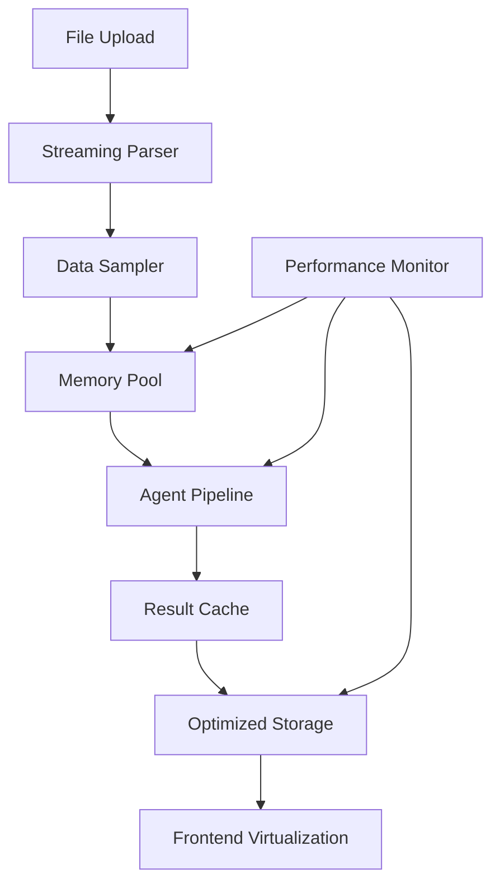

# Performance Optimization Design

## Overview

This design addresses critical performance bottlenecks in the data visualization platform by implementing systematic optimizations across data processing, agent pipeline execution, database operations, and frontend rendering. The solution focuses on reducing memory usage, optimizing data flow, and implementing intelligent caching without changing the existing tech stack.

## Architecture

### Current Performance Issues Identified

1. **Full Dataset Processing**: Agents process entire datasets instead of statistical samples
2. **Memory Inefficiency**: Large datasets loaded entirely into memory multiple times
3. **Sequential Data Copying**: Data copied between agents unnecessarily
4. **Database Inefficiency**: Individual row inserts and unoptimized queries
5. **Frontend Blocking**: Large data rendering without virtualization
6. **No Caching**: Repeated computations for similar datasets

### Optimization Strategy

The design implements a multi-layered optimization approach:



## Components and Interfaces

### 1. Streaming Data Processor

**Purpose**: Replace current full-dataset loading with streaming processing

**Interface**:
```python
class StreamingDataProcessor:
    def __init__(self, chunk_size: int = 10000, memory_limit: int = 100_000_000):
        self.chunk_size = chunk_size
        self.memory_limit = memory_limit
    
    async def process_file_stream(self, file: File) -> DataStream:
        """Process file in chunks, yielding data streams"""
        
    def create_statistical_sample(self, stream: DataStream, sample_size: int = 5000) -> DataFrame:
        """Create representative sample for analysis"""
        
    def get_memory_usage(self) -> int:
        """Monitor current memory usage"""
```

**Implementation Details**:
- Use pandas `read_csv(chunksize=...)` for streaming CSV processing
- Implement reservoir sampling for large datasets to get representative samples
- Monitor memory usage and adjust chunk sizes dynamically
- Store only statistical sample + metadata, not full dataset

### 2. Optimized Agent Pipeline

**Purpose**: Minimize data copying and redundant processing between agents

**Interface**:
```python
class OptimizedAgentPipeline:
    def __init__(self):
        self.data_cache = {}
        self.result_cache = LRUCache(maxsize=100)
    
    async def analyze_with_shared_context(self, sample_data: DataFrame, dataset_id: str) -> AnalysisResponse:
        """Run pipeline with shared data context to avoid copying"""
        
    def create_data_fingerprint(self, data: DataFrame) -> str:
        """Create hash for caching similar datasets"""
```

**Optimization Strategies**:
- Pass data references between agents instead of copying
- Cache intermediate results (statistical summaries, correlation matrices)
- Use data fingerprinting to identify similar datasets for cache hits
- Limit profiler analysis to statistical sample (5000 rows max)

### 3. Database Optimization Layer

**Purpose**: Optimize database operations for better performance

**Interface**:
```python
class OptimizedDatabaseClient:
    def __init__(self):
        self.connection_pool = ConnectionPool(max_connections=10)
        self.query_cache = TTLCache(maxsize=200, ttl=300)
    
    async def batch_insert_analyses(self, analyses: List[AgentAnalysis]) -> None:
        """Insert multiple analyses in single transaction"""
        
    async def get_cached_results(self, dataset_id: str) -> Optional[AnalysisResponse]:
        """Retrieve cached results if available"""
        
    def compress_json_data(self, data: Dict) -> bytes:
        """Compress large JSON before storage"""
```

**Implementation Details**:
- Use batch inserts for agent analyses instead of individual inserts
- Implement query result caching with 5-minute TTL
- Compress large JSONB data using gzip before database storage
- Add database query performance monitoring

### 4. Memory Management System

**Purpose**: Prevent memory exhaustion and optimize resource usage

**Interface**:
```python
class MemoryManager:
    def __init__(self, max_memory_mb: int = 512):
        self.max_memory = max_memory_mb * 1024 * 1024
        self.current_usage = 0
        self.processing_queue = asyncio.Queue()
    
    async def acquire_memory(self, required_bytes: int) -> bool:
        """Check if memory is available for processing"""
        
    def release_memory(self, bytes_to_release: int) -> None:
        """Release memory after processing"""
        
    def get_memory_stats(self) -> Dict[str, int]:
        """Get current memory usage statistics"""
```

**Memory Optimization Strategies**:
- Implement request queuing when memory usage > 80%
- Force garbage collection after each analysis completion
- Use memory-mapped files for large dataset processing
- Monitor and log memory usage patterns

### 5. Frontend Performance Layer

**Purpose**: Optimize UI responsiveness and data rendering

**Interface**:
```typescript
class PerformanceOptimizer {
    private dataCache = new Map<string, any>();
    private renderQueue = new Set<string>();
    
    optimizeDataForVisualization(data: any[], maxPoints: number = 1000): any[] {
        // Downsample data for chart rendering
    }
    
    implementVirtualScrolling(container: HTMLElement, data: any[]): void {
        // Virtual scrolling for large datasets
    }
    
    useProgressiveLoading(datasetId: string): void {
        // Progressive data loading with status updates
    }
}
```

**Frontend Optimizations**:
- Implement virtual scrolling for data tables (react-window)
- Limit chart data points to 1000 for rendering performance
- Use progressive loading with skeleton screens
- Implement exponential backoff for status polling

### 6. Intelligent Caching System

**Purpose**: Cache computations and results to avoid redundant processing

**Cache Layers**:

1. **Data Fingerprint Cache**: Cache statistical profiles for similar datasets
2. **AI Response Cache**: Cache Gemini API responses for similar prompts
3. **Analysis Result Cache**: Cache complete analysis results
4. **Chart Configuration Cache**: Cache chart recommendations for similar data patterns

**Implementation**:
```python
class IntelligentCache:
    def __init__(self):
        self.data_fingerprint_cache = TTLCache(maxsize=500, ttl=3600)
        self.ai_response_cache = TTLCache(maxsize=200, ttl=1800)
        self.analysis_cache = TTLCache(maxsize=100, ttl=900)
    
    def get_data_fingerprint(self, data: DataFrame) -> str:
        """Create fingerprint based on column types, stats, and patterns"""
        
    async def get_cached_analysis(self, fingerprint: str) -> Optional[AnalysisResponse]:
        """Retrieve cached analysis for similar data"""
        
    def cache_analysis_result(self, fingerprint: str, result: AnalysisResponse) -> None:
        """Cache analysis result with fingerprint key"""
```

## Data Models

### Optimized Data Structures

```python
@dataclass
class OptimizedDataset:
    """Memory-efficient dataset representation"""
    id: str
    fingerprint: str
    sample_data: pd.DataFrame  # Max 5000 rows
    statistical_summary: Dict[str, Any]
    column_metadata: Dict[str, ColumnInfo]
    file_metadata: FileMetadata
    
    def __post_init__(self):
        # Ensure sample data doesn't exceed limits
        if len(self.sample_data) > 5000:
            self.sample_data = self.sample_data.sample(n=5000)

@dataclass
class ProcessingContext:
    """Shared context between agents to avoid data copying"""
    dataset_id: str
    sample_data: pd.DataFrame
    statistical_cache: Dict[str, Any]
    correlation_cache: Optional[pd.DataFrame]
    memory_usage: int
```

### Database Schema Optimizations

```sql
-- Add indexes for performance
CREATE INDEX CONCURRENTLY IF NOT EXISTS idx_agent_analyses_dataset_agent 
ON agent_analyses(dataset_id, agent_type);

CREATE INDEX CONCURRENTLY IF NOT EXISTS idx_datasets_fingerprint 
ON datasets USING HASH ((metadata->>'fingerprint'));

-- Add compression for large JSONB fields
ALTER TABLE agent_analyses 
ALTER COLUMN analysis_data SET COMPRESSION lz4;

-- Partitioning for large tables (if needed)
CREATE TABLE agent_analyses_partitioned (
    LIKE agent_analyses INCLUDING ALL
) PARTITION BY RANGE (created_at);
```

## Error Handling

### Memory Pressure Handling
- Queue requests when memory usage exceeds thresholds
- Implement graceful degradation (smaller samples, reduced features)
- Provide clear error messages for resource constraints

### Performance Monitoring
- Log processing times for each optimization
- Track cache hit rates and memory usage
- Alert on performance degradation

### Fallback Strategies
- Fall back to smaller sample sizes if memory constrained
- Use simplified analysis for very large datasets
- Provide partial results if full analysis fails

## Testing Strategy

### Performance Testing
1. **Load Testing**: Test with datasets of varying sizes (1MB to 500MB)
2. **Memory Testing**: Monitor memory usage under concurrent load
3. **Cache Testing**: Verify cache hit rates and performance improvements
4. **Database Testing**: Test query performance with optimized indexes

### Benchmarking
- Measure processing time improvements for each optimization
- Compare memory usage before and after optimizations
- Track database query performance improvements
- Monitor frontend rendering performance

### Integration Testing
- Test complete pipeline with optimizations enabled
- Verify data accuracy is maintained with sampling
- Test error handling under resource constraints
- Validate caching behavior across different scenarios