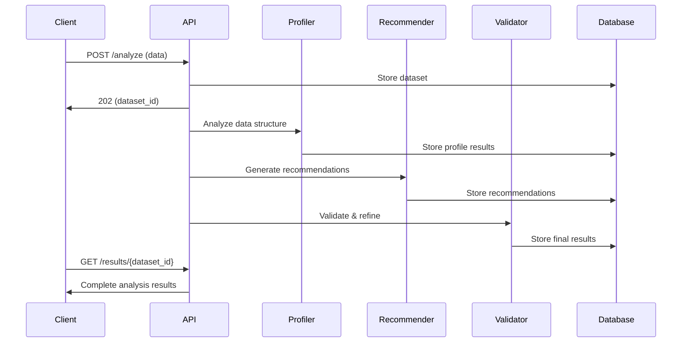

# GraphSense API Documentation

## Overview

The GraphSense API is a FastAPI-based backend that powers the AI-driven data visualization platform. It features a sophisticated 3-agent pipeline that analyzes datasets and generates intelligent chart recommendations.

**Base URL**: `http://localhost:8000` (development)
**API Documentation**: `http://localhost:8000/docs` (Interactive Swagger UI)
**Alternative Docs**: `http://localhost:8000/redoc` (ReDoc)

## Architecture

### 3-Agent Pipeline

The system uses three specialized AI agents powered by Google Gemini:

1. **Enhanced Data Profiler Agent**: Comprehensive statistical analysis, correlation detection, and data quality assessment
2. **Chart Recommender Agent**: Evaluates all 10 chart types with confidence scoring and data mapping
3. **Validation Agent**: Quality assessment, appropriateness validation, and recommendation refinement

### Supported Chart Types

- Bar Charts
- Line Charts
- Scatter Plots
- Pie Charts
- Histograms
- Box Plots
- Heatmaps
- Area Charts
- Treemaps
- Sankey Diagrams

## Authentication

Currently, the API supports anonymous access for development and hackathon use. Future versions will implement Supabase authentication.

## Endpoints

### Health Check

#### `GET /health`

Check the health status of the API and connected services.

**Response:**
```json
{
  "status": "healthy",
  "timestamp": "2024-01-15T10:30:00Z",
  "services": {
    "database": "connected",
    "agents": "ready"
  }
}
```

### Dataset Analysis

#### `POST /api/analysis/analyze`

Start dataset analysis using the 3-agent pipeline.

**Request Body:**
```json
{
  "data": [
    {"column1": "value1", "column2": 123},
    {"column1": "value2", "column2": 456}
  ],
  "filename": "dataset.csv",
  "file_type": "csv",
  "options": {
    "skipEmptyRows": true,
    "maxRows": 10000
  }
}
```

**Response:**
```json
{
  "success": true,
  "dataset_id": "550e8400-e29b-41d4-a716-446655440000",
  "recommendations": [],
  "data_profile": null,
  "processing_time_ms": 0,
  "message": "Analysis started. Use the status endpoint to check progress."
}
```

**Parameters:**
- `data` (required): Array of data objects with consistent structure
- `filename` (optional): Original filename for reference
- `file_type` (optional): File type (csv, json, xlsx, tsv)
- `options` (optional): Additional processing options

**Limitations:**
- Maximum 50,000 rows for optimal performance
- Maximum file size: 100MB
- Supported formats: CSV, JSON, Excel (.xlsx/.xls), TSV

#### `GET /api/analysis/status/{dataset_id}`

Get the current analysis status for a dataset.

**Response:**
```json
{
  "dataset_id": "550e8400-e29b-41d4-a716-446655440000",
  "status": "processing",
  "progress": {
    "profiler": "completed",
    "recommender": "running",
    "validator": "pending"
  },
  "estimated_completion": "2024-01-15T10:35:00Z"
}
```

**Status Values:**
- `pending`: Analysis not started
- `processing`: Analysis in progress
- `completed`: Analysis finished successfully
- `failed`: Analysis failed with errors

#### `GET /api/analysis/results/{dataset_id}`

Get the complete analysis results for a dataset.

**Response:**
```json
{
  "success": true,
  "dataset_id": "550e8400-e29b-41d4-a716-446655440000",
  "recommendations": [
    {
      "chartType": "line",
      "confidence": 0.92,
      "justification": "Strong temporal correlation with clear trend pattern",
      "config": {
        "xAxis": "date",
        "yAxis": "sales",
        "title": "Sales Trend Over Time",
        "data": [...],
        "color": "region"
      }
    }
  ],
  "data_profile": {
    "columns": ["date", "sales", "region"],
    "rowCount": 1500,
    "dataQuality": "high",
    "columnProfiles": [...],
    "correlations": {...},
    "patterns": [...]
  },
  "processing_time_ms": 5420,
  "message": "Analysis completed successfully"
}
```

### Visualizations

#### `POST /api/visualizations`

Save a visualization configuration.

**Request Body:**
```json
{
  "dataset_id": "550e8400-e29b-41d4-a716-446655440000",
  "chart_type": "line",
  "title": "Sales Performance Q4",
  "description": "Quarterly sales trends by region",
  "chart_config": {
    "xAxis": "date",
    "yAxis": "sales",
    "title": "Sales Trend Over Time",
    "data": [...],
    "styling": {...}
  },
  "is_shared": false
}
```

#### `GET /api/visualizations/{visualization_id}`

Get a specific visualization by ID.

#### `PUT /api/visualizations/{visualization_id}/share`

Enable or disable sharing for a visualization.

**Request Body:**
```json
{
  "is_shared": true
}
```

**Response:**
```json
{
  "success": true,
  "share_token": "abc123def456...",
  "share_url": "http://localhost:3000/shared/abc123def456...",
  "message": "Visualization sharing enabled"
}
```

#### `GET /api/visualizations/shared/{share_token}`

Get a shared visualization by its public token.

### Data Models

#### AnalysisRequest
```typescript
interface AnalysisRequest {
  data: Record<string, any>[];
  filename?: string;
  file_type?: string;
  options?: Record<string, any>;
}
```

#### ChartRecommendation
```typescript
interface ChartRecommendation {
  chartType: 'line' | 'bar' | 'scatter' | 'pie' | 'histogram' | 'box_plot' | 'heatmap' | 'area' | 'treemap' | 'sankey';
  confidence: number; // 0-1
  justification: string;
  config: ChartConfig;
}
```

#### DataProfile
```typescript
interface DataProfile {
  columns: string[];
  rowCount: number;
  dataQuality: 'high' | 'medium' | 'low';
  columnProfiles: ColumnProfile[];
  correlations: Record<string, number>;
  patterns: Pattern[];
}
```

## Error Handling

The API uses standard HTTP status codes and returns structured error responses:

```json
{
  "error": "Validation failed",
  "status_code": 400,
  "details": {
    "field": "data",
    "message": "Data array cannot be empty"
  }
}
```

### Common Status Codes

- `200 OK`: Request successful
- `201 Created`: Resource created successfully
- `400 Bad Request`: Invalid request data
- `404 Not Found`: Resource not found
- `422 Unprocessable Entity`: Validation error
- `500 Internal Server Error`: Server error

## Rate Limiting

Currently no rate limiting is implemented for development. Production deployment should implement appropriate rate limiting based on usage patterns.

## Examples

### Complete Analysis Workflow

1. **Start Analysis**:
```bash
curl -X POST "http://localhost:8000/api/analysis/analyze" \
  -H "Content-Type: application/json" \
  -d '{
    "data": [
      {"date": "2024-01-01", "sales": 1000, "region": "North"},
      {"date": "2024-01-02", "sales": 1200, "region": "South"}
    ],
    "filename": "sales_data.csv",
    "file_type": "csv"
  }'
```

2. **Check Status**:
```bash
curl "http://localhost:8000/api/analysis/status/550e8400-e29b-41d4-a716-446655440000"
```

3. **Get Results**:
```bash
curl "http://localhost:8000/api/analysis/results/550e8400-e29b-41d4-a716-446655440000"
```

### Agent Pipeline Flow



## Development

### Running the API

```bash
# Start with Docker
docker-compose up backend

# Or run locally
cd backend
pip install -r requirements.txt
uvicorn main:app --reload --port 8000
```

### Environment Variables

```bash
# Required
GEMINI_API_KEY=your_gemini_api_key
SUPABASE_URL=your_supabase_project_url
SUPABASE_SERVICE_KEY=your_supabase_service_key

# Optional
LOG_LEVEL=info
ENVIRONMENT=development
```

### Testing

```bash
# Run integration tests
node test/test-integration.js

# Test specific endpoint
curl "http://localhost:8000/health"
```

## Security Considerations

- Input validation on all endpoints
- File size and row count limitations
- SQL injection prevention through ORM
- Cross-origin resource sharing (CORS) configured
- Environment variable protection

## Performance

### Optimization Features

- Background task processing for analysis
- Efficient data type detection
- Optimized Gemini API batching
- Database connection pooling
- Caching for repeated analyses

### Monitoring

- Structured logging with correlation IDs
- Processing time tracking
- Agent performance metrics
- Error rate monitoring

## Future Enhancements

- User authentication and authorization
- Real-time progress updates via WebSockets
- Advanced caching strategies
- API versioning
- Enhanced security features
- Performance optimizations
- Multi-language support

---

**Last Updated**: January 2025
**Version**: 1.0.0
**Contact**: GraphSense Team