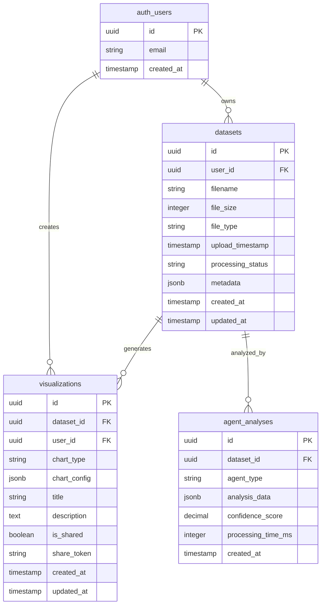
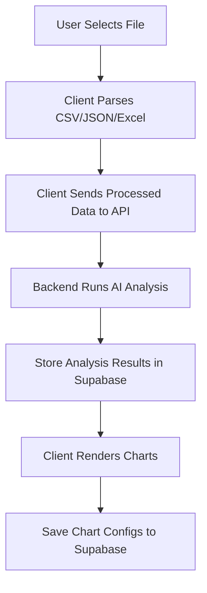

# Database Schema Overview

## Entity Relationship Diagram



## Table Details & Data Examples

### 1. `datasets` Table
**Purpose**: Stores uploaded dataset files and their processing status

**Example Record**:
```json
{
  "id": "550e8400-e29b-41d4-a716-446655440000",
  "user_id": "123e4567-e89b-12d3-a456-426614174000",
  "filename": "sales_data_2024.csv",
  "file_size": 2048576,
  "file_type": "csv",
  "upload_timestamp": "2024-01-15T10:30:00Z",
  "processing_status": "completed",
  "metadata": {
    "columns": ["date", "product", "sales", "region"],
    "row_count": 1500,
    "data_types": {
      "date": "temporal",
      "product": "categorical", 
      "sales": "numeric",
      "region": "categorical"
    },
    "file_hash": "abc123...",
    "original_headers": ["Date", "Product Name", "Sales Amount", "Region"]
  }
}
```

### 2. `agent_analyses` Table
**Purpose**: Stores results from each AI agent in the 3-agent pipeline

**Example Records**:

**Data Profiler Agent**:
```json
{
  "id": "660e8400-e29b-41d4-a716-446655440001",
  "dataset_id": "550e8400-e29b-41d4-a716-446655440000",
  "agent_type": "profiler",
  "confidence_score": 0.95,
  "processing_time_ms": 1250,
  "analysis_data": {
    "statistical_summary": {
      "sales": {
        "mean": 15420.50,
        "median": 12000.00,
        "std_dev": 8500.25,
        "min": 500.00,
        "max": 85000.00,
        "distribution": "right_skewed"
      }
    },
    "correlations": [
      {"columns": ["date", "sales"], "correlation": 0.65, "type": "temporal_trend"}
    ],
    "patterns": {
      "seasonality": "quarterly_peaks",
      "trends": "upward_growth",
      "outliers": 12,
      "missing_values": 0
    },
    "data_quality": {
      "completeness": 1.0,
      "consistency": 0.98,
      "accuracy_score": 0.95
    }
  }
}
```

**Chart Recommender Agent**:
```json
{
  "id": "770e8400-e29b-41d4-a716-446655440002",
  "dataset_id": "550e8400-e29b-41d4-a716-446655440000",
  "agent_type": "recommender",
  "confidence_score": 0.88,
  "processing_time_ms": 2100,
  "analysis_data": {
    "recommendations": [
      {
        "chart_type": "line",
        "confidence": 0.92,
        "reasoning": "Strong temporal correlation with clear trend pattern",
        "data_mapping": {
          "x_axis": "date",
          "y_axis": "sales",
          "grouping": "region"
        },
        "suitability_score": 0.95
      },
      {
        "chart_type": "bar",
        "confidence": 0.85,
        "reasoning": "Good for comparing sales across regions",
        "data_mapping": {
          "x_axis": "region",
          "y_axis": "sales",
          "grouping": "product"
        },
        "suitability_score": 0.82
      }
    ],
    "rejected_charts": [
      {
        "chart_type": "pie",
        "reason": "Too many categories, would be cluttered"
      }
    ]
  }
}
```

**Validation Agent**:
```json
{
  "id": "880e8400-e29b-41d4-a716-446655440003",
  "dataset_id": "550e8400-e29b-41d4-a716-446655440000",
  "agent_type": "validator",
  "confidence_score": 0.91,
  "processing_time_ms": 800,
  "analysis_data": {
    "validated_recommendations": [
      {
        "chart_type": "line",
        "validation_score": 0.94,
        "quality_metrics": {
          "data_ink_ratio": 0.85,
          "cognitive_load": "low",
          "clarity_score": 0.92
        },
        "refinements": {
          "suggested_title": "Sales Trend Over Time by Region",
          "axis_improvements": ["Format dates as 'MMM YYYY'", "Add currency formatting"]
        }
      }
    ],
    "final_ranking": [
      {"chart_type": "line", "final_score": 0.94},
      {"chart_type": "bar", "final_score": 0.81}
    ]
  }
}
```

### 3. `visualizations` Table
**Purpose**: Stores saved chart configurations and sharing settings

**Example Record**:
```json
{
  "id": "990e8400-e29b-41d4-a716-446655440004",
  "dataset_id": "550e8400-e29b-41d4-a716-446655440000",
  "user_id": "123e4567-e89b-12d3-a456-426614174000",
  "chart_type": "line",
  "title": "Q4 Sales Performance by Region",
  "description": "Quarterly sales trends showing regional performance",
  "is_shared": true,
  "share_token": "abc123def456",
  "chart_config": {
    "data_mapping": {
      "x_axis": "date",
      "y_axis": "sales",
      "grouping": "region"
    },
    "styling": {
      "colors": ["#3B82F6", "#EF4444", "#10B981", "#F59E0B"],
      "theme": "modern",
      "show_grid": true,
      "show_legend": true
    },
    "interactions": {
      "zoom_enabled": true,
      "hover_details": true,
      "filter_options": ["region", "product"]
    },
    "export_settings": {
      "width": 800,
      "height": 600,
      "format": "svg"
    }
  }
}
```

## Data Flow Example

Here's how data flows through our system:

1. **Upload**: User uploads `sales_data_2024.csv`
   - Creates record in `datasets` table with `processing_status: "pending"`

2. **Agent Pipeline Execution**:
   - **Profiler Agent** analyzes data → stores results in `agent_analyses`
   - **Recommender Agent** suggests charts → stores results in `agent_analyses`  
   - **Validator Agent** validates recommendations → stores results in `agent_analyses`
   - Updates `datasets.processing_status` to `"completed"`

3. **Visualization Creation**:
   - User selects recommended line chart
   - Creates record in `visualizations` table with chart config

4. **Sharing**:
   - User enables sharing → generates `share_token`
   - Others can access via token without authentication

## Data Storage Strategy

### 🎯 **Client-Side Dataset Processing (Our Approach)**

We're using a **privacy-first, client-centric** approach:



### 📊 **What We Store Where**

**Client Browser (Temporary)**:
- 📁 Raw dataset files (never leave user's device)
- 🔄 Parsed data for visualization rendering

**Supabase Database (Persistent)**:
- 🤖 AI analysis results from 3-agent pipeline
- 📊 Chart configurations and customizations
- 🔗 Sharing tokens and permissions
- 📈 Chart export metadata

### 🗄️ **Updated Database Schema**

**datasets table** (simplified):
```json
{
  "id": "550e8400-e29b-41d4-a716-446655440000",
  "user_id": "123e4567-e89b-12d3-a456-426614174000",
  "filename": "sales_data_2024.csv",
  "file_size": 2048576,
  "processing_status": "completed",
  "metadata": {
    "columns": ["date", "product", "sales", "region"],
    "row_count": 1500,
    "data_types": {
      "date": "temporal",
      "product": "categorical", 
      "sales": "numeric",
      "region": "categorical"
    },
    "sample_rows": [
      {"date": "2024-01-01", "sales": 15420, "region": "North"},
      {"date": "2024-01-02", "sales": 12300, "region": "South"}
    ]
  }
}
```

**Key Benefits**:
- 🔒 **Privacy**: Raw data never leaves user's browser
- ⚡ **Performance**: No file upload/download bottlenecks
- 💰 **Cost**: No storage costs for raw datasets
- 🔄 **Consistency**: Analysis results persist, charts can be recreated

## Query Patterns

**Get all analyses for a dataset**:
```sql
SELECT * FROM agent_analyses 
WHERE dataset_id = '550e8400-e29b-41d4-a716-446655440000'
ORDER BY created_at;
```

**Get user's recent visualizations**:
```sql
SELECT v.*, d.filename 
FROM visualizations v
JOIN datasets d ON v.dataset_id = d.id
WHERE v.user_id = '123e4567-e89b-12d3-a456-426614174000'
ORDER BY v.created_at DESC;
```

**Get final recommendations for a dataset**:
```sql
SELECT analysis_data->'validated_recommendations' as recommendations
FROM agent_analyses 
WHERE dataset_id = '550e8400-e29b-41d4-a716-446655440000' 
AND agent_type = 'validator';
```