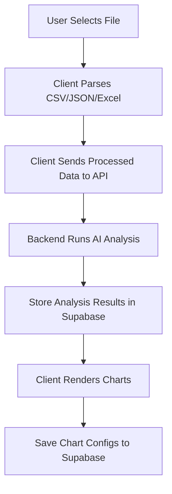

# Database Schema Overview

## Entity Relationship Diagram

```mermaid
erDiagram
    auth_users ||--o| profiles : "has"
    auth_users ||--o{ datasets : "owns"
    auth_users ||--o{ visualizations : "creates"
    auth_users ||--o{ canvases : "owns"
    auth_users ||--o{ canvas_collaborators : "member_of"
    auth_users ||--o{ canvas_elements : "created_by"
    datasets ||--o{ visualizations : "generates"
    datasets ||--o{ agent_analyses : "analyzed_by"
    datasets ||--o{ canvas_datasets : "linked_via"
    canvases ||--o{ canvas_datasets : "contains"
    canvases ||--o{ canvas_collaborators : "has"
    canvases ||--o{ canvas_elements : "holds"

    auth_users {
        uuid id PK
        string email
        timestamp created_at
    }

    profiles {
        uuid id PK_FK
        string display_name
        char avatar_color
        timestamp created_at
        timestamp updated_at
    }

    datasets {
        uuid id PK
        uuid user_id FK
        string filename
        integer file_size
        string file_type
        timestamp processing_timestamp
        string processing_status
        jsonb data_profile
        jsonb sample_data
        jsonb metadata
        timestamp created_at
        timestamp updated_at
    }

    visualizations {
        uuid id PK
        uuid dataset_id FK
        uuid user_id FK
        string chart_type
        jsonb chart_config
        string title
        text description
        boolean is_shared
        string share_token
        timestamp created_at
        timestamp updated_at
    }

    agent_analyses {
        uuid id PK
        uuid dataset_id FK
        string agent_type
        jsonb analysis_data
        decimal confidence_score
        integer processing_time_ms
        timestamp created_at
    }

    canvases {
        uuid id PK
        uuid owner_id FK
        string name
        text description
        string share_token
        string share_permission
        jsonb thumbnail
        timestamp created_at
        timestamp updated_at
    }

    canvas_datasets {
        uuid canvas_id FK
        uuid dataset_id FK
        timestamp added_at
    }

    canvas_collaborators {
        uuid id PK
        uuid canvas_id FK
        uuid user_id FK
        string permission
        timestamp joined_at
    }

    canvas_elements {
        uuid id PK
        uuid canvas_id FK
        string element_type
        jsonb position
        jsonb size
        jsonb data
        integer z_index
        uuid created_by FK
        timestamp created_at
        timestamp updated_at
    }
```

> **Note:** The ER diagram reflects the live schema in `backend/database/schema.sql`. If columns change, regenerate or update `frontend/lib/supabase/types.ts` to keep frontend type definitions in sync (e.g., `datasets.upload_timestamp` was renamed to `processing_timestamp`).

## Table Details & Data Examples

### 1. `datasets` Table
**Purpose**: Stores uploaded dataset files and their processing status

**Example Record**:
```json
{
  "id": "550e8400-e29b-41d4-a716-446655440000",
  "user_id": "123e4567-e89b-12d3-a456-426614174000",
  "filename": "sales_data_2024.csv",
  "file_size": 2048576,
  "file_type": "csv",
  "upload_timestamp": "2024-01-15T10:30:00Z",
  "processing_status": "completed",
  "metadata": {
    "columns": ["date", "product", "sales", "region"],
    "row_count": 1500,
    "data_types": {
      "date": "temporal",
      "product": "categorical", 
      "sales": "numeric",
      "region": "categorical"
    },
    "file_hash": "abc123...",
    "original_headers": ["Date", "Product Name", "Sales Amount", "Region"]
  }
}
```

### 2. `agent_analyses` Table
**Purpose**: Stores results from each AI agent in the 3-agent pipeline

**Example Records**:

**Data Profiler Agent**:
```json
{
  "id": "660e8400-e29b-41d4-a716-446655440001",
  "dataset_id": "550e8400-e29b-41d4-a716-446655440000",
  "agent_type": "profiler",
  "confidence_score": 0.95,
  "processing_time_ms": 1250,
  "analysis_data": {
    "statistical_summary": {
      "sales": {
        "mean": 15420.50,
        "median": 12000.00,
        "std_dev": 8500.25,
        "min": 500.00,
        "max": 85000.00,
        "distribution": "right_skewed"
      }
    },
    "correlations": [
      {"columns": ["date", "sales"], "correlation": 0.65, "type": "temporal_trend"}
    ],
    "patterns": {
      "seasonality": "quarterly_peaks",
      "trends": "upward_growth",
      "outliers": 12,
      "missing_values": 0
    },
    "data_quality": {
      "completeness": 1.0,
      "consistency": 0.98,
      "accuracy_score": 0.95
    }
  }
}
```

**Chart Recommender Agent**:
```json
{
  "id": "770e8400-e29b-41d4-a716-446655440002",
  "dataset_id": "550e8400-e29b-41d4-a716-446655440000",
  "agent_type": "recommender",
  "confidence_score": 0.88,
  "processing_time_ms": 2100,
  "analysis_data": {
    "recommendations": [
      {
        "chart_type": "line",
        "confidence": 0.92,
        "reasoning": "Strong temporal correlation with clear trend pattern",
        "data_mapping": {
          "x_axis": "date",
          "y_axis": "sales",
          "grouping": "region"
        },
        "suitability_score": 0.95
      },
      {
        "chart_type": "bar",
        "confidence": 0.85,
        "reasoning": "Good for comparing sales across regions",
        "data_mapping": {
          "x_axis": "region",
          "y_axis": "sales",
          "grouping": "product"
        },
        "suitability_score": 0.82
      }
    ],
    "rejected_charts": [
      {
        "chart_type": "pie",
        "reason": "Too many categories, would be cluttered"
      }
    ]
  }
}
```

**Validation Agent**:
```json
{
  "id": "880e8400-e29b-41d4-a716-446655440003",
  "dataset_id": "550e8400-e29b-41d4-a716-446655440000",
  "agent_type": "validator",
  "confidence_score": 0.91,
  "processing_time_ms": 800,
  "analysis_data": {
    "validated_recommendations": [
      {
        "chart_type": "line",
        "validation_score": 0.94,
        "quality_metrics": {
          "data_ink_ratio": 0.85,
          "cognitive_load": "low",
          "clarity_score": 0.92
        },
        "refinements": {
          "suggested_title": "Sales Trend Over Time by Region",
          "axis_improvements": ["Format dates as 'MMM YYYY'", "Add currency formatting"]
        }
      }
    ],
    "final_ranking": [
      {"chart_type": "line", "final_score": 0.94},
      {"chart_type": "bar", "final_score": 0.81}
    ]
  }
}
```

### 3. `profiles` Table
**Purpose**: Stores user display names and avatar colors. One row per `auth.users` entry, created client-side on first login via the `useProfile` hook.

| Column | Type | Notes |
|---|---|---|
| `id` | UUID PK | References `auth.users(id)` |
| `display_name` | VARCHAR(50) | Min 2 chars (trimmed) |
| `avatar_color` | CHAR(7) | Hex color, e.g. `#4F46E5` |
| `created_at` | TIMESTAMPTZ | |
| `updated_at` | TIMESTAMPTZ | Auto-updated by trigger |

**RLS**: Readable by any authenticated user; insert/update restricted to own row.

---

### 4. `canvases` Table
**Purpose**: Named workspaces where users organize datasets and charts. Supports link-based sharing with `view` or `edit` permission.

| Column | Type | Notes |
|---|---|---|
| `id` | UUID PK | |
| `owner_id` | UUID FK | References `auth.users(id)` |
| `name` | VARCHAR(255) | |
| `description` | TEXT | Optional |
| `share_token` | VARCHAR(64) UNIQUE | Present only when sharing is active |
| `share_permission` | VARCHAR(4) | `'view'` or `'edit'`; always set together with `share_token` |
| `thumbnail` | JSONB | Auto-saved canvas preview |
| `created_at` | TIMESTAMPTZ | |
| `updated_at` | TIMESTAMPTZ | Auto-updated by trigger |

**RLS**: Owner has full control. Collaborators can SELECT. Insert/update/delete are owner-only.

---

### 5. `canvas_datasets` Table
**Purpose**: Join table linking datasets to canvases. A collaborator may only link datasets they own to prevent privilege escalation.

| Column | Type | Notes |
|---|---|---|
| `canvas_id` | UUID FK | References `canvases(id)` |
| `dataset_id` | UUID FK | References `datasets(id)` |
| `added_at` | TIMESTAMPTZ | |

**Primary Key**: `(canvas_id, dataset_id)`

**RLS**: SELECT requires canvas access (owner or collaborator). INSERT requires edit permission on the canvas AND ownership of the dataset. DELETE requires edit permission.

**Supabase Realtime**: Enabled — clients receive live events when datasets are linked/unlinked from a canvas.

---

### 6. `canvas_collaborators` Table
**Purpose**: Tracks per-user permissions (view or edit) on a canvas. Rows are created or updated by the backend when a user joins via `POST /api/canvases/join` (the RPC exists in schema but is not called directly — the service-role key bypasses `auth.uid()` so the backend resolves the token and upserts the row itself).

| Column | Type | Notes |
|---|---|---|
| `id` | UUID PK | |
| `canvas_id` | UUID FK | References `canvases(id)` |
| `user_id` | UUID FK | References `auth.users(id)` |
| `permission` | VARCHAR(4) | `'view'` or `'edit'` |
| `joined_at` | TIMESTAMPTZ | |

**Unique constraint**: `(canvas_id, user_id)`

**RLS**: A user can read their own rows; the canvas owner can read all collaborator rows. Only the canvas owner can delete rows.

---

### 7. `canvas_elements` Table
**Purpose**: Persistent canvas elements (charts, datasets, tables, maps, text blocks) with world-coordinate positions. Supports real-time collaborative editing.

| Column | Type | Notes |
|---|---|---|
| `id` | UUID PK | |
| `canvas_id` | UUID FK | References `canvases(id)` |
| `element_type` | TEXT | `'dataset'`, `'chart'`, `'table'`, `'map'`, `'text'` |
| `position` | JSONB | `{ x: number, y: number }` in world coordinates |
| `size` | JSONB | `{ width: number, height: number }` |
| `data` | JSONB | Element-specific payload (chart config, dataset reference, etc.) |
| `z_index` | INTEGER | Stacking order; default `0` |
| `created_by` | UUID FK | References `auth.users(id)` |
| `created_at` | TIMESTAMPTZ | |
| `updated_at` | TIMESTAMPTZ | Auto-updated by trigger |

**RLS**: SELECT requires canvas access (owner or collaborator). Write operations (INSERT/UPDATE/DELETE) require edit permission. The `service_role` has unrestricted access for backend writes.

---

### 8. `visualizations` Table
**Purpose**: Stores saved chart configurations and sharing settings

**Example Record**:
```json
{
  "id": "990e8400-e29b-41d4-a716-446655440004",
  "dataset_id": "550e8400-e29b-41d4-a716-446655440000",
  "user_id": "123e4567-e89b-12d3-a456-426614174000",
  "chart_type": "line",
  "title": "Q4 Sales Performance by Region",
  "description": "Quarterly sales trends showing regional performance",
  "is_shared": true,
  "share_token": "abc123def456",
  "chart_config": {
    "data_mapping": {
      "x_axis": "date",
      "y_axis": "sales",
      "grouping": "region"
    },
    "styling": {
      "colors": ["#3B82F6", "#EF4444", "#10B981", "#F59E0B"],
      "theme": "modern",
      "show_grid": true,
      "show_legend": true
    },
    "interactions": {
      "zoom_enabled": true,
      "hover_details": true,
      "filter_options": ["region", "product"]
    },
    "export_settings": {
      "width": 800,
      "height": 600,
      "format": "svg"
    }
  }
}
```

## Data Flow Example

Here's how data flows through our system:

1. **Upload**: User uploads `sales_data_2024.csv`
   - Creates record in `datasets` table with `processing_status: "pending"`

2. **Agent Pipeline Execution**:
   - **Profiler Agent** analyzes data → stores results in `agent_analyses`
   - **Recommender Agent** suggests charts → stores results in `agent_analyses`  
   - **Validator Agent** validates recommendations → stores results in `agent_analyses`
   - Updates `datasets.processing_status` to `"completed"`

3. **Visualization Creation**:
   - User selects recommended line chart
   - Creates record in `visualizations` table with chart config

4. **Canvas Organization**:
   - User creates a named canvas (`canvases` table)
   - Links datasets to the canvas via `canvas_datasets`
   - Places charts, tables, and other elements on the canvas (`canvas_elements`), stored as world-coordinate positions

5. **Canvas Sharing**:
   - Owner generates a share link → `share_token` and `share_permission` set on the `canvases` row
   - Collaborator visits the link → client calls `POST /api/canvases/join` with the share token → backend upserts a row into `canvas_collaborators`
   - Collaborator can view (or edit, depending on permission) datasets and elements on the shared canvas

6. **Visualization Sharing** (per-chart):
   - User enables sharing on a visualization → `share_token` auto-generated
   - Others can access the chart via token without authentication

## Data Storage Strategy

### 🎯 **Client-Side Dataset Processing (Our Approach)**

We're using a **privacy-first, client-centric** approach:



### 📊 **What We Store Where**

**Client Browser (Temporary)**:
- 📁 Raw dataset files (never leave user's device)
- 🔄 Parsed data for visualization rendering

**Supabase Database (Persistent)**:
- 🤖 AI analysis results from 3-agent pipeline
- 📊 Chart configurations and customizations
- 🔗 Sharing tokens and permissions
- 📈 Chart export metadata

### 🗄️ **Updated Database Schema**

**datasets table** (simplified):
```json
{
  "id": "550e8400-e29b-41d4-a716-446655440000",
  "user_id": "123e4567-e89b-12d3-a456-426614174000",
  "filename": "sales_data_2024.csv",
  "file_size": 2048576,
  "processing_status": "completed",
  "metadata": {
    "columns": ["date", "product", "sales", "region"],
    "row_count": 1500,
    "data_types": {
      "date": "temporal",
      "product": "categorical", 
      "sales": "numeric",
      "region": "categorical"
    },
    "sample_rows": [
      {"date": "2024-01-01", "sales": 15420, "region": "North"},
      {"date": "2024-01-02", "sales": 12300, "region": "South"}
    ]
  }
}
```

**Key Benefits**:
- 🔒 **Privacy**: Raw data never leaves user's browser
- ⚡ **Performance**: No file upload/download bottlenecks
- 💰 **Cost**: No storage costs for raw datasets
- 🔄 **Consistency**: Analysis results persist, charts can be recreated

## Query Patterns

**Get all analyses for a dataset**:
```sql
SELECT * FROM agent_analyses 
WHERE dataset_id = '550e8400-e29b-41d4-a716-446655440000'
ORDER BY created_at;
```

**Get user's recent visualizations**:
```sql
SELECT v.*, d.filename 
FROM visualizations v
JOIN datasets d ON v.dataset_id = d.id
WHERE v.user_id = '123e4567-e89b-12d3-a456-426614174000'
ORDER BY v.created_at DESC;
```

**Get final recommendations for a dataset**:
```sql
SELECT analysis_data->'validated_recommendations' as recommendations
FROM agent_analyses
WHERE dataset_id = '550e8400-e29b-41d4-a716-446655440000'
AND agent_type = 'validator';
```

**Get all canvases accessible to the current user (owned + collaborated)**:
```sql
SELECT c.*,
       CASE WHEN c.owner_id = auth.uid() THEN 'owner' ELSE cc.permission END AS user_role
FROM canvases c
LEFT JOIN canvas_collaborators cc ON cc.canvas_id = c.id AND cc.user_id = auth.uid()
WHERE c.owner_id = auth.uid() OR cc.user_id = auth.uid()
ORDER BY c.updated_at DESC;
```

**Get all datasets linked to a canvas**:
```sql
SELECT d.*
FROM datasets d
JOIN canvas_datasets cd ON cd.dataset_id = d.id
WHERE cd.canvas_id = '<canvas_id>'
ORDER BY cd.added_at;
```

**Get all elements on a canvas ordered by z-index**:
```sql
SELECT * FROM canvas_elements
WHERE canvas_id = '<canvas_id>'
ORDER BY z_index ASC, created_at ASC;
```

**Join a canvas via share token** (application flow via backend API):
```bash
curl -X POST /api/canvases/join \
  -H "Content-Type: application/json" \
  -d '{"token": "<share_token>"}'
```