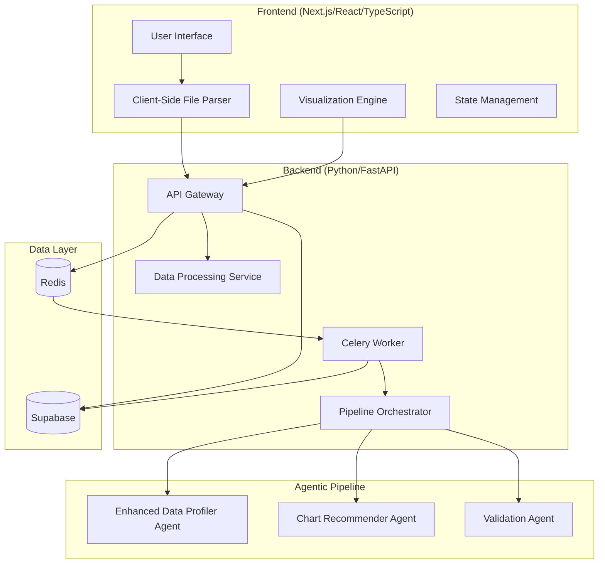

# Design Document

## Overview

GraphSense is a full-stack web application that leverages an intelligent agentic pipeline to automatically analyze datasets and recommend optimal visualizations. The system combines Next.js 15/React frontend with a Python backend featuring multiple specialized AI agents powered by Google Gemini that collaborate to provide high-quality chart recommendations with transparent reasoning.

The core innovation lies in the multi-agent architecture where specialized Gemini-powered agents handle different aspects of data analysis, chart selection, and validation, creating a robust feedback loop that ensures recommendation quality and provides clear justifications for visualization choices. The entire system is containerized with Docker for seamless cross-platform deployment.

## Architecture

### High-Level Architecture



### Technology Stack

**Frontend:**

- Next.js 15 with App Router for server-side rendering and routing
- React 19 with TypeScript for type-safe component development
- Tailwind CSS for responsive styling
- Recharts for interactive visualizations
- D3.js for low-level data visualization primitives
- TanStack React Query for server state management and data fetching
- Zustand for lightweight client state management

**Backend:**

- Python 3.13+ with FastAPI for high-performance API development
- Pydantic for data validation and serialization
- Pandas and NumPy for data processing and analysis
- Google Gemini API for agent reasoning and LLM capabilities

**Infrastructure:**

- Supabase for database, authentication, and data persistence
- Redis for job queue (Celery broker) and result backend
- Celery for async background workers
- Docker for containerization and cross-platform compatibility

## Components and Interfaces

### Frontend Components

#### Core UI Components

```typescript
interface DatasetSelectorProps {
  onFileSelect: (processedData: ProcessedDataset) => Promise<void>;
  supportedFormats: string[];
  maxFileSize: number;
}

interface VisualizationRecommendation {
  id: string;
  chartType: ChartType;
  confidence: number;
  reasoning: AgentReasoning[];
  dataMapping: DataMapping;
  interactionOptions: InteractionConfig;
}

interface AgentReasoning {
  agentType: "profiler" | "recommender" | "validator";
  reasoning: string;
  confidence: number;
  evidence: string[];
}
```

#### Visualization Engine

```typescript
interface ChartRenderer {
  renderChart(
    data: ProcessedDataset,
    config: ChartConfiguration,
    container: HTMLElement
  ): Promise<ChartInstance>;

  updateChart(
    instance: ChartInstance,
    newConfig: Partial<ChartConfiguration>
  ): void;

  exportChart(
    instance: ChartInstance,
    format: "png" | "svg" | "pdf"
  ): Promise<Blob>;
}
```

### Backend Services

#### Pipeline Orchestrator

```python
class PipelineOrchestrator:
    def __init__(self):
        self.agents = {
            'profiler': EnhancedDataProfilerAgent(),
            'recommender': ChartRecommenderAgent(),
            'validator': ValidationAgent()
        }
        self.batch_manager = BatchedAPIManager()

    async def process_dataset(
        self,
        dataset: ProcessedDataset
    ) -> List[VisualizationRecommendation]:
        # Orchestrate 3-agent pipeline with batched API calls
        pass
```

#### Optimized Agent Architecture

```python
class EnhancedDataProfilerAgent(BaseAgent):
    """Comprehensive data analysis including profiling, patterns, and relationships"""
    
    async def analyze(self, dataset: ProcessedDataset) -> ComprehensiveDataAnalysis:
        # Combined: statistical analysis, data type detection, quality assessment,
        # correlation analysis, trend detection, pattern recognition
        pass

class ChartRecommenderAgent(BaseAgent):
    """Recommends from ALL 10 chart types with data-driven reasoning"""
    
    async def recommend(
        self,
        analysis: ComprehensiveDataAnalysis
    ) -> List[ChartRecommendation]:
        # Evaluates ALL chart types: Bar, Line, Scatter, Pie, Histogram, 
        # Box Plot, Heatmap, Area, Treemap, Sankey
        # Returns top 3-5 with confidence scores and data mapping
        pass

class ValidationAgent(BaseAgent):
    """Validates and refines recommendations with quality scoring"""
    
    async def validate(
        self,
        recommendations: List[ChartRecommendation],
        analysis: ComprehensiveDataAnalysis
    ) -> List[ValidatedRecommendation]:
        # Quality scoring, appropriateness validation, recommendation refinement
        pass

class BatchedAPIManager:
    """Optimizes Gemini API calls through intelligent batching"""
    
    async def batch_agent_calls(
        self,
        agents: List[BaseAgent],
        dataset: ProcessedDataset
    ) -> Dict[str, Any]:
        # Batches multiple agent prompts into fewer API calls
        # Reduces latency and API costs
        pass
```

### Data Processing Pipeline

#### Data Processing Service

```python
class DataProcessingService:
    """Processes client-parsed data for agent analysis"""
    
    async def process_dataset(self, client_data: Dict) -> ProcessedDataset:
        # Validate and standardize client-parsed data
        # Perform additional data quality checks
        # Prepare data for agent analysis
        pass

    def enhance_data_profile(self, dataset: ProcessedDataset) -> ProcessedDataset:
        # Add server-side data insights
        # Perform advanced statistical analysis
        pass

    def validate_client_data(self, data: Dict) -> bool:
        # Validate data structure and content from client
        pass
```

## Data Models

### Core Data Models

```python
from pydantic import BaseModel
from typing import List, Dict, Optional, Union
from enum import Enum

class DataType(str, Enum):
    NUMERIC = "numeric"
    CATEGORICAL = "categorical"
    TEMPORAL = "temporal"
    TEXT = "text"
    BOOLEAN = "boolean"

class ChartType(str, Enum):
    BAR = "bar"
    LINE = "line"
    SCATTER = "scatter"
    PIE = "pie"
    HISTOGRAM = "histogram"
    BOX_PLOT = "box_plot"
    HEATMAP = "heatmap"
    AREA = "area"
    TREEMAP = "treemap"
    SANKEY = "sankey"

class ProcessedDataset(BaseModel):
    id: str
    filename: str
    columns: Dict[str, DataType]
    row_count: int
    data_quality_score: float
    sample_data: List[Dict[str, Union[str, int, float]]]
    metadata: Dict[str, any]

class DataProfile(BaseModel):
    dataset_id: str
    column_profiles: Dict[str, ColumnProfile]
    correlations: Dict[str, float]
    data_quality_issues: List[DataQualityIssue]
    statistical_summary: Dict[str, any]

class ColumnProfile(BaseModel):
    name: str
    data_type: DataType
    null_percentage: float
    unique_values: int
    distribution_summary: Dict[str, any]
    sample_values: List[any]

class ChartRecommendation(BaseModel):
    chart_type: ChartType
    confidence: float
    data_mapping: DataMapping
    reasoning: List[AgentReasoning]
    interaction_config: InteractionConfig
    styling_suggestions: Dict[str, any]

class DataMapping(BaseModel):
    x_axis: Optional[str]
    y_axis: Optional[str]
    color: Optional[str]
    size: Optional[str]
    facet: Optional[str]
    additional_dimensions: Dict[str, str]
```

### Database Schema (Supabase)

```sql
-- Users and authentication handled by Supabase Auth

-- Datasets table
CREATE TABLE datasets (
    id UUID PRIMARY KEY DEFAULT gen_random_uuid(),
    user_id UUID REFERENCES auth.users(id),
    filename VARCHAR NOT NULL,
    file_size INTEGER NOT NULL,
    processing_timestamp TIMESTAMP WITH TIME ZONE DEFAULT NOW(),
    processing_status VARCHAR DEFAULT 'pending',
    data_profile JSONB,
    sample_data JSONB,
    created_at TIMESTAMP WITH TIME ZONE DEFAULT NOW()
);

-- Visualizations table
CREATE TABLE visualizations (
    id UUID PRIMARY KEY DEFAULT gen_random_uuid(),
    dataset_id UUID REFERENCES datasets(id),
    user_id UUID REFERENCES auth.users(id),
    chart_type VARCHAR NOT NULL,
    configuration JSONB NOT NULL,
    agent_reasoning JSONB NOT NULL,
    is_shared BOOLEAN DEFAULT FALSE,
    share_token VARCHAR UNIQUE,
    created_at TIMESTAMP WITH TIME ZONE DEFAULT NOW(),
    updated_at TIMESTAMP WITH TIME ZONE DEFAULT NOW()
);

-- Agent analysis results
CREATE TABLE agent_analyses (
    id UUID PRIMARY KEY DEFAULT gen_random_uuid(),
    dataset_id UUID REFERENCES datasets(id),
    agent_type VARCHAR NOT NULL,
    analysis_result JSONB NOT NULL,
    confidence_score FLOAT,
    processing_time_ms INTEGER,
    created_at TIMESTAMP WITH TIME ZONE DEFAULT NOW()
);
```

## Error Handling

### Frontend Error Handling

- Global error boundary for React components
- Toast notifications for user-facing errors
- Retry mechanisms for failed API calls
- Graceful degradation for visualization rendering failures

### Backend Error Handling

```python
class AgentError(Exception):
    """Base exception for agent-related errors"""
    pass

class DataProcessingError(AgentError):
    """Raised when data processing fails"""
    pass

class RecommendationError(AgentError):
    """Raised when chart recommendation fails"""
    pass

# Error handling middleware
@app.exception_handler(AgentError)
async def agent_error_handler(request: Request, exc: AgentError):
    return JSONResponse(
        status_code=422,
        content={
            "error": "Agent Processing Error",
            "message": str(exc),
            "suggestions": get_error_suggestions(exc)
        }
    )
```

### Agentic Pipeline Error Recovery

- Fallback mechanisms when individual agents fail
- Partial results delivery when some agents succeed
- Automatic retry with exponential backoff
- Human escalation for persistent failures

### Docker Configuration

The application will be fully containerized for cross-platform compatibility and easy setup:

```yaml
# docker-compose.yml (simplified example — see repository root for full config)
version: "3.8"
services:
  frontend:
    build:
      context: ./frontend
      dockerfile: Dockerfile
    ports:
      - "3000:3000"
    environment:
      - NEXT_PUBLIC_API_URL=http://localhost:8000
      - NEXT_PUBLIC_SUPABASE_URL=${NEXT_PUBLIC_SUPABASE_URL}
      - NEXT_PUBLIC_SUPABASE_PUBLISHABLE_KEY=${NEXT_PUBLIC_SUPABASE_PUBLISHABLE_KEY}
    volumes:
      - ./frontend:/app
      - /app/node_modules
    depends_on:
      - backend

  backend:
    build:
      context: ./backend
      dockerfile: Dockerfile
    ports:
      - "8000:8000"
    environment:
      - GEMINI_API_KEY=${GEMINI_API_KEY}
      - SUPABASE_URL=${SUPABASE_URL}
      - SUPABASE_SECRET_KEY=${SUPABASE_SECRET_KEY}
      - REDIS_URL=redis://redis:6379/0
      - CELERY_BROKER_URL=redis://redis:6379/0
      - CELERY_RESULT_BACKEND=redis://redis:6379/1
    volumes:
      - ./backend:/app
      - ./uploads:/app/uploads
    depends_on:
      - redis

  worker:
    build:
      context: ./backend
    command: celery -A app.worker worker --loglevel=info --concurrency=2
    environment:
      - GEMINI_API_KEY=${GEMINI_API_KEY}
      - SUPABASE_URL=${SUPABASE_URL}
      - SUPABASE_SECRET_KEY=${SUPABASE_SECRET_KEY}
      - REDIS_URL=redis://redis:6379/0
      - CELERY_BROKER_URL=redis://redis:6379/0
      - CELERY_RESULT_BACKEND=redis://redis:6379/1
    depends_on:
      - backend
      - redis

  redis:
    image: redis:7-alpine
```

### Gemini API Integration

```python
# Gemini agent configuration
class GeminiAgentConfig:
    def __init__(self):
        self.api_key = os.getenv("GEMINI_API_KEY")
        self.model = "gemini-2.5-flash-lite"  # Configured Gemini model
        self.temperature = 0.1  # Low temperature for consistent reasoning
        self.max_tokens = 4096

class BaseAgent:
    def __init__(self, config: GeminiAgentConfig):
        self.config = config
        self.client = genai.GenerativeModel(config.model)

    async def generate_response(self, prompt: str, context: Dict) -> str:
        response = await self.client.generate_content(
            prompt,
            generation_config=genai.types.GenerationConfig(
                temperature=self.config.temperature,
                max_output_tokens=self.config.max_tokens
            )
        )
        return response.text
```

## Canvas Collaboration

Each user can create multiple named canvases. A canvas is a persistent infinite workspace containing zero or more elements of the following types: `chart`, `dataset`, `table`, `map`, or `text`. All element positions are stored in **world coordinates** (not screen pixels); the frontend applies the transform `screen = (world * zoom) + pan` at render time.

Canvases can be shared via a unique token. The owner may invite collaborators and assign them either `view` or `edit` permission. Collaborators with `edit` permission can add, move, and delete elements; `view` collaborators can only read the canvas. The owner can toggle collaborator permissions at any time through the ShareDialog. Canvas metadata (name, thumbnail, last-modified) is visible in the canvas directory, which supports search and sort.

This design provides a robust foundation for the GraphSense platform, with a focus on the agentic pipeline architecture, scalable async processing via Celery/Redis, canvas collaboration, and production-grade Docker containerization using Google Gemini for intelligent reasoning.